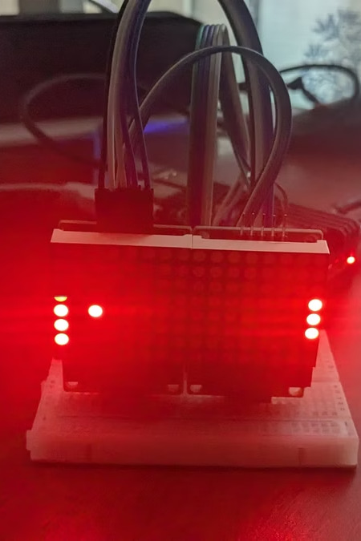
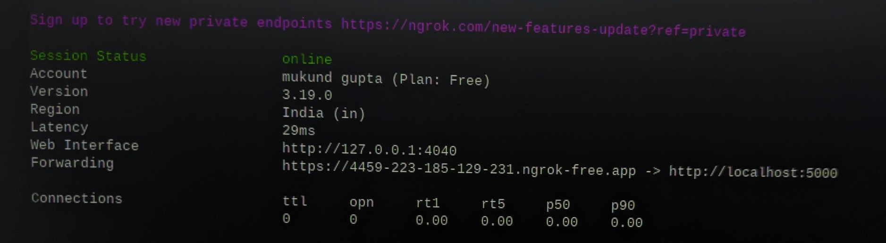
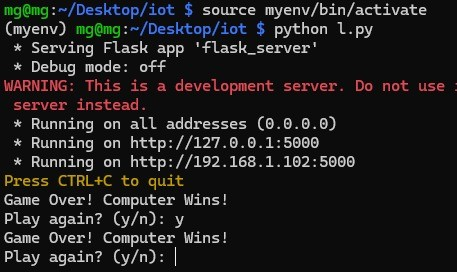
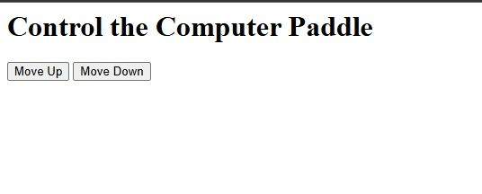
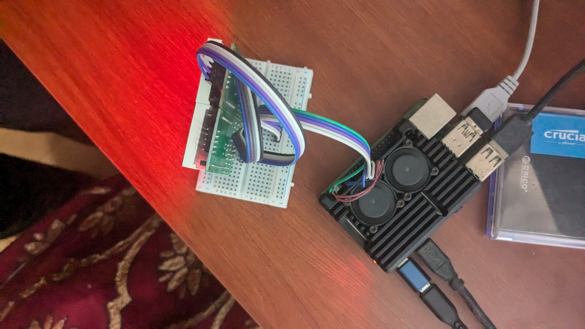

# IoT-Enabled Pong (LED Matrix, Remote Web Control)

A playable Pong rendered across two daisy-chained MAX7219 8×8 LED matrices on a
Raspberry Pi 4, with a second player able to control the "computer" paddle remotely
from any browser via a Flask server tunneled through ngrok.



## Context

Originally built as an independent personal project, then later submitted as a
5th-semester IoT Fundamentals write-up (Dayananda Sagar University, January 2025) —
it wasn't assigned coursework; it was an existing build repurposed to satisfy a
course requirement.

## What it does

- A 16×8 display is formed by daisy-chaining two 8×8 MAX7219 LED matrix modules over
  SPI, driven from a Raspberry Pi 4.
- A Flask web server (running in a background thread alongside the game loop) serves
  a page with "Move Up" / "Move Down" buttons.
- [ngrok](https://ngrok.com/) tunnels that local Flask server to a public URL, so a
  second player on a completely different device/network can control the
  right-hand ("computer") paddle from their own browser.
- The game loop moves the ball, checks paddle/wall collisions, tracks score, and
  renders the current frame to the LED matrix — first to 5 points wins.

## A note on the source

The only surviving source for this project is the code embedded in the written
report (reconstructed here verbatim, aside from fixing the report's mangled
`__name__`/`__main__`). That report is titled *"IoT-Enabled **Gesture**-Controlled
Pong Game,"* describes physical up/down buttons for both paddles, and mentions
WebSocket for low-latency control — none of which appears in the code section it
includes:

- The left ("player") paddle in the included code is moved by `random.random()`,
  not a button read.
- Control of the right ("computer") paddle is a plain HTTP `fetch(...)` POST to
  `/control`, not a WebSocket connection.
- No gesture-sensing code appears anywhere in what's included.

It's possible the actually-deployed version had a button-reading module and/or a
WebSocket connection that simply didn't make it into the report's code excerpt —
that's common in write-ups trimmed for length. Absent a fuller source file turning
up, this repository documents exactly what's verifiable from the surviving code,
and no more.

## Verified architecture

```
Browser (anywhere) ──POST /control {direction}──▶ ngrok public URL
                                                         │
                                                         ▼
                                          Flask server (background thread, port 5000)
                                                         │  get_computer_move()
                                                         ▼
                                    Game loop (l.py): ball physics, collisions, scoring
                                                         │
                                                         ▼
                              luma.led_matrix / luma.core — SPI0 (spi(port=0, device=0))
                                                         │
                                                         ▼
                         2× MAX7219 8×8 LED matrix, daisy-chained (cascaded=2) → 16×8 canvas
```

## Verified components

Read directly from the report's own hardware list and its embedded photos:

- Raspberry Pi 4 (4GB RAM)
- Crucial SATA SSD, 128GB (stores the OS/code — not part of the game logic itself)
- 2× MAX7219 8×8 LED dot-matrix modules, daisy-chained over SPI
- ngrok (free tier) for the public tunnel
- Python, Flask, `luma.led_matrix`, `luma.core`

## Setup

On a Raspberry Pi with two MAX7219 8×8 matrices daisy-chained on the SPI bus:

```bash
pip install flask luma.led_matrix luma.core
```

1. Wire the two MAX7219 modules daisy-chained on SPI0 (`port=0, device=0` in the code —
   the standard Pi SPI header pins, no custom GPIO pin assignment needed).
2. Start the game: `python l.py` (this imports and starts `flask_server.py` automatically,
   which begins serving on port 5000 as a side effect of import).
3. In a separate terminal, expose it publicly with [ngrok](https://ngrok.com/):
   `ngrok http 5000`.
4. Share the `https://....ngrok-free.app` URL ngrok prints — anyone who opens it gets the
   "Move Up" / "Move Down" page and can drive the right-hand paddle from their own browser.

**What you should see when it works:** the two LED matrices light up showing a ball and two
3-pixel paddles bouncing between them; the terminal running `l.py` stays quiet until someone
wins, at which point it prints `Game Over! Player Wins!` or `Game Over! Computer Wins!` and
asks `Play again? (y/n)`; the ngrok terminal shows `Session Status: online` with a
`Forwarding` line pointing at `localhost:5000`. All three are exactly what's shown in the
screenshots below.

## Proof this actually ran

All three of these are real screenshots from the original report, reproduced here
unmodified:

| | |
|---|---|
|  | ngrok forwarding a public URL to the local Flask server |
|  | The actual terminal session — `python l.py` running on the Pi, real "Game Over!" output |
|  | The remote-control web page, as actually rendered |



## Known limitations

- In the surviving code, the player paddle is programmatic (`random.random()`), not
  button-driven, and computer-paddle control is plain HTTP POST, not WebSocket — see
  the note above on why this may not reflect the full original build.
- No automated tests; verification is the three screenshots above plus a source
  compile-check of the reconstructed files in this repository.
- Demonstrated working at least once (the screenshots below), not maintained since.

## Next steps

- Track down the original deployed source (Pi SD card / backup) if it still exists,
  in case it has the button-reading and WebSocket code the report describes but
  doesn't show — and replace the reconstructed files here with it if so.
- If it doesn't turn up, wire the player paddle to real physical buttons and either
  add real WebSocket support or drop that line from the description.

## What this demonstrates

Daisy-chaining physical display hardware into one larger addressable canvas,
exposing a Raspberry Pi's local web server to the public internet via a tunneling
service for remote control without hosting any infrastructure, and running a
background web server thread alongside a real-time hardware render loop in the same
process. Also — surfaced by auditing this project's own report against its own code —
a concrete example of checking a project's claims against what its code actually
does before repeating those claims anywhere else.
